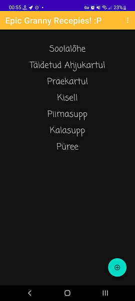

# Epic Granny Recepies! :P

## Intro
I know I know... Lame name for the app... But think about your granny. She is/was epic, right?! :P

Now... This app is about single Granny in this world who has made so many tasty meals over her life.
The cooking is 100% home made, not processed industrially or anything. Well except maybe canned corn etc.
In modern times where food is heavily processed and information is the easiest to share with everyone
and also preserve the past for later use or for reminiscence, Granny recepies come real handy in cooking
proper meals that are tasty and will make you full for long time of the day. Beware though, some meals
are very heavy on calories despite being just normal everyday food. For an instance, the borsch soup.
The soup is everyday food but if you make it like the spoon will be standing in your plate vertically,
well then you will have great experience of being full for the better part of next six hours!

All in all, this project is basically in a way a preservation of information about home cooked meal
recepies. Work is still in progress and new recepies constantly being added over time.

If you want to have some recepie added that you think would be great to have in Epic Granny app, then
unfortunately you are looking at the wrong project. Any other modification or improvement to the app is
welcome and appreciated, but recepies will not be added from third party people.
Existing recepies will also not be modified to be exact step-by-step with all the ingredients and
their amount needed. Experimentation is the key, just like your Granny would like you to learn. :)

P.S and NB!!!! WHen making meals, you have to be full of love and hapiness and wonders, otherwise
all your trial and errors will be wasted and your meals wont be as tasty as they should be...
Enjoy the making of small wonders, not cooking itself!

## App view
### **Main view**
Main view of the app where you will have a list of all the recepies gathered from The Granny.

### **Recepies view**
Recepie view of the app where after choosing your desired recepie, you will have almost step-by-step
instructions with some basic ingredients needed for the meal. But amount are yours to decide which is
the secret of all the Grannies in the world, they "just throw stuff in the mix" and "I dont know
how much, I just throw stuff in, taste it, and throw stuff in if there is not enough!"

## Installation

### 1. Building yourself
One way is for you to install Android Studio with all the needed packages and builds, SDK-s etc.
Then clone repository to local directory, open it in Android Studio and then build it yourself.

### 2. APK
Nope, not yet introducing that. Not ready for it. Have not yet learned it to introduce such thing.

